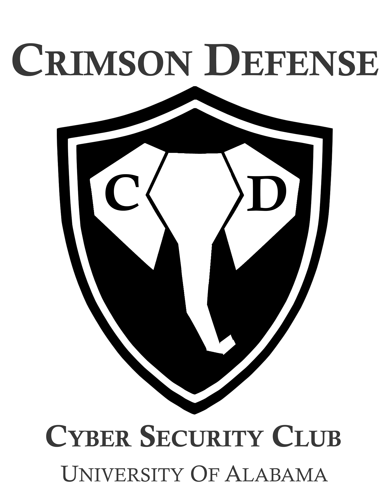

# The University of Alabama's Cyber Security Club
Welcome to the Crimson Defense github for Crimson Cyber Defense club members and individuals interested in learning more about Cyber Security!
Here you will find everything you need when it comes to learning more about Cyber Security. There is information and resources for beginners up
up to advanced individuals who are looking to learn more and advance their skills in cyber security! Please make sure you carefully read all READMEs 
in every repository as they all contain important information that could help with finding certain resources and getting things set up properly!

 
<b>Email:</b> crimsonCyberDefense@gmail.com  
<b>Slack:</b> https://bit.ly/2yGRfV5  
<b>Website:</b> uacrimsondefense.github.io 
 

## Where to Start
One of most puzzling things to figure out, especially when trying to start learning about cybersecurity. There is so much to learn, which is one of the reasons why it is so great. But with there being so much information out there it can be hard to figure out where to even begin. This folder will help those brand new to cybersecurity. Individuals who have little to no experience and want to get started but don't know where to go. Hopefully the resources here will help you understand what cybersecurity is all about.

## Beginner
Learn what cybersecurity is all about. Make sure you check out 0 to 100 if you are brand new to all of this, learning the basics is important!